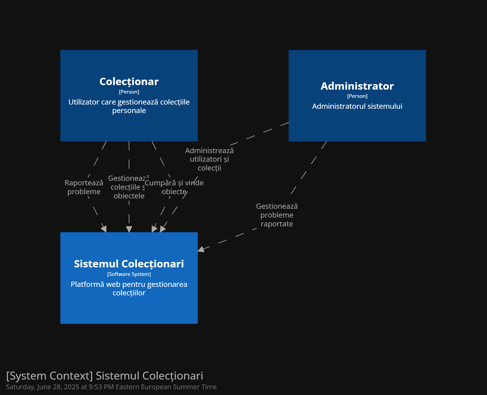

    OCo – Object Collector Web App

OCo este o aplicație Web destinată colecționarilor de obiecte de interes (dopuri de plută, mărci poștale, viniluri etc.). Utilizatorii autentificați își pot crea, organiza și partaja colecțiile, pot pune obiecte la vânzare, face oferte, accesa statistici și exporta datele în format CSV sau PDF.

    Tehnologii utilizate

Frontend: HTML, CSS, JavaScript (Vanilla)
Backend: PHP
Bază de date: SQLite
Stocare fișiere: local (imagini salvate în `frontend/uploads`)
Server local: XAMPP (Apache + PHP)
Autentificare: JWT (JSON Web Tokens)
Export: FPDF pentru generarea de fișiere PDF

    Cum rulez local

1) Instalează XAMPP
2) Clonează sau descarcă proiectul în folderul `htdocs`
3) Pornește Apache din XAMPP Control Panel
4) Accesează în browser: http://localhost/colectionari/frontend/landing.html

    Autentificare

Accesul la funcționalitățile aplicației este disponibil doar utilizatorilor autentificați. Utilizatorii pot:
- Crea colecții și obiecte
- Vizualiza colecțiile altor utilizatori
- Pune obiecte/colecții la vânzare și face oferte
- Vizualiza istoricul tranzacțiilor
- Exporta statistici în CSV / PDF
- Căuta și filtra colecții
- Accesa dashboard-ul personal
- Gestiona profilul personal
- Raporta probleme în caz de necesitate

    Structura proiectului

/backend/
api/ -> endpoint-uri PHP pentru API
db/ -> bază de date SQLite și scripturi inițializare
lib/ -> librării (FPDF, JWT)
/frontend/
assets/ -> imagini și resurse statice
css/ -> fișiere CSS pentru styling
js/ -> scripturi JavaScript
uploads/ -> fișiere încărcate (imagini obiecte, avatare)
diagrame/ -> diagrame C4 pentru arhitectură
*.html -> pagini HTML

    Arhitectură

Aplicația este structurată monolitic și a fost documentată cu ajutorul Modelului C4 (niveluri C1–C4).  

    Diagrama C1 – Context

    Diagrama C2 – Container

    Diagrama C3 – Component

    Diagrama C4 – Code

    Licență

Acest proiect este publicat sub licență [MIT](./LICENSE)  
Toate resursele utilizate respectă termenii Creative Commons sau licențe libere.

Echipa Lidl (Albert Andreea, Chiuaru Cosmin)
Proiect educațional realizat în cadrul laboratorului de Tehnologii Web, coordonat de Lect. Dr. Captarencu Oana.

